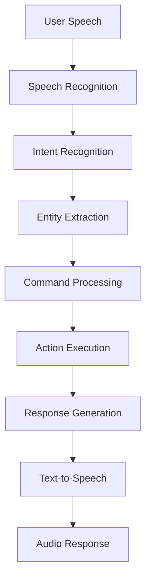

# 05 - Voice Commands

## Learning Objectives
By the end of this lesson, you will:
- Build voice-controlled applications with speech recognition
- Implement intent recognition and voice commands
- Create interactive voice assistants and chatbots
- Use GPT-4o-Realtime for advanced voice interactions
- Handle complex conversational AI scenarios

## What are Voice Commands?

Voice commands enable users to control applications, devices, and services using natural speech. Azure AI provides powerful tools for building voice-controlled experiences, from simple command recognition to sophisticated conversational AI [1].

### Core Technologies

#### 1. Speech Recognition
Converts spoken words into text for command processing.

#### 2. Intent Recognition
Understands the meaning and intent behind user speech.

#### 3. Natural Language Understanding (NLU)
Extracts entities and context from voice commands.

#### 4. Conversational AI
Enables back-and-forth conversations with AI assistants.

## Voice Command Architecture



## Building Voice Command Systems

### Simple Command Recognition

#### Python - Basic Voice Commands
```python
import azure.cognitiveservices.speech as speechsdk
import json
import re
from typing import Dict, List, Callable

class VoiceCommandProcessor:
    def __init__(self, speech_key: str, region: str):
        self.speech_config = speechsdk.SpeechConfig(
            subscription=speech_key,
            region=region
        )
        self.speech_config.speech_recognition_language = "en-US"
        
        # Command patterns and handlers
        self.commands = {}
        self.register_default_commands()
        
    def register_default_commands(self):
        """Register basic voice commands"""
        
        # Navigation commands
        self.register_command(
            patterns=[r"go to (\w+)", r"navigate to (\w+)", r"open (\w+)"],
            handler=self.handle_navigation,
            description="Navigate to different sections"
        )
        
        # Control commands
        self.register_command(
            patterns=[r"(start|stop|pause|resume) (.+)", r"(play|stop) music"],
            handler=self.handle_media_control,
            description="Control media playback"
        )
        
        # Information commands
        self.register_command(
            patterns=[r"what is the (weather|time|date)", r"tell me about (.+)"],
            handler=self.handle_information_request,
            description="Get information"
        )
        
        # Smart home commands
        self.register_command(
            patterns=[r"turn (on|off) the (.+)", r"set (.+) to (\d+)"],
            handler=self.handle_smart_home,
            description="Control smart home devices"
        )
        
    def register_command(self, patterns: List[str], handler: Callable, description: str):
        """Register a new voice command"""
        for pattern in patterns:
            self.commands[pattern] = {
                'handler': handler,
                'description': description,
                'pattern': re.compile(pattern, re.IGNORECASE)
            }
    
    async def start_continuous_recognition(self):
        """Start listening for voice commands"""
        
        recognizer = speechsdk.SpeechRecognizer(
            speech_config=self.speech_config
        )
        
        def handle_recognized(evt):
            text = evt.result.text.strip()
            if text:
                print(f"🎤 Heard: {text}")
                self.process_command(text)
        
        def handle_canceled(evt):
            print(f"❌ Recognition canceled: {evt.cancellation_details.reason}")
        
        # Connect event handlers
        recognizer.recognized.connect(handle_recognized)
        recognizer.canceled.connect(handle_canceled)
        
        # Start continuous recognition
        recognizer.start_continuous_recognition()
        print("🎤 Voice command system active. Say something...")
        
        # Keep running
        import time
        try:
            while True:
                time.sleep(1)
        except KeyboardInterrupt:
            recognizer.stop_continuous_recognition()
            print("Voice command system stopped.")
    
    def process_command(self, text: str) -> Dict:
        """Process voice command and execute appropriate action"""
        
        for pattern_str, command_info in self.commands.items():
            pattern = command_info['pattern']
            match = pattern.search(text)
            
            if match:
                print(f"✅ Command matched: {command_info['description']}")
                
                # Extract parameters
                params = match.groups() if match.groups() else []
                
                # Execute handler
                try:
                    result = command_info['handler'](text, *params)
                    return {
                        'success': True,
                        'command': pattern_str,
                        'params': params,
                        'result': result
                    }
                except Exception as e:
                    print(f"❌ Command execution failed: {str(e)}")
                    return {
                        'success': False,
                        'error': str(e)
                    }
        
        # No command matched
        print(f"❓ Unrecognized command: {text}")
        return {
            'success': False,
            'error': 'Command not recognized'
        }
    
    # Command Handlers
    def handle_navigation(self, text: str, destination: str) -> str:
        """Handle navigation commands"""
        destinations = {
            'home': '/dashboard',
            'settings': '/settings',
            'profile': '/profile',
            'reports': '/reports',
            'help': '/help'
        }
        
        if destination.lower() in destinations:
            url = destinations[destination.lower()]
            print(f"🧭 Navigating to {destination} ({url})")
            return f"Navigated to {destination}"
        else:
            return f"Unknown destination: {destination}"
    
    def handle_media_control(self, text: str, action: str, target: str = None) -> str:
        """Handle media control commands"""
        actions = {
            'play': '▶️',
            'pause': '⏸️',
            'stop': '⏹️',
            'resume': '▶️',
            'start': '▶️'
        }
        
        icon = actions.get(action.lower(), '🎵')
        message = f"{icon} {action.title()}"
        
        if target:
            message += f" {target}"
        
        print(message)
        return message
    
    def handle_information_request(self, text: str, info_type: str) -> str:
        """Handle information requests"""
        import datetime
        
        responses = {
            'weather': "🌤️ It's 72°F and sunny today",
            'time': f"🕐 Current time is {datetime.datetime.now().strftime('%I:%M %p')}",
            'date': f"📅 Today is {datetime.datetime.now().strftime('%A, %B %d, %Y')}"
        }
        
        response = responses.get(info_type.lower(), f"ℹ️ Information about {info_type}")
        print(response)
        return response
    
    def handle_smart_home(self, text: str, action: str, device: str, value: str = None) -> str:
        """Handle smart home device commands"""
        if value:
            message = f"🏠 Setting {device} to {value}"
        else:
            state = "on" if action.lower() == "on" else "off"
            icon = "💡" if "light" in device.lower() else "🔌"
            message = f"{icon} Turning {device} {state}"
        
        print(message)
        return message

# Usage example
async def main():
    processor = VoiceCommandProcessor(
        speech_key=os.environ["AZURE_SPEECH_KEY"],
        region=os.environ["AZURE_SPEECH_REGION"]
    )
    
    # Add custom commands
    processor.register_command(
        patterns=[r"send email to (.+)", r"email (.+)"],
        handler=lambda text, recipient: f"📧 Sending email to {recipient}",
        description="Send email commands"
    )
    
    await processor.start_continuous_recognition()

if __name__ == "__main__":
    import asyncio
    import os
    asyncio.run(main())
```

### Advanced Intent Recognition

#### JavaScript - Intent-Based Voice Assistant
```javascript
class IntentBasedVoiceAssistant {
    constructor(subscriptionKey, region) {
        this.speechConfig = SpeechSDK.SpeechConfig.fromSubscription(subscriptionKey, region);
        this.speechConfig.speechRecognitionLanguage = "en-US";
        
        // Intent recognition with LUIS
        this.intentRecognizer = new SpeechSDK.IntentRecognizer(this.speechConfig);
        this.setupIntents();
        this.setupEventHandlers();
    }
    
    setupIntents() {
        // Create LUIS model for intent recognition
        const model = SpeechSDK.LanguageUnderstandingModel.fromAppId("YOUR_LUIS_APP_ID");
        
        // Add intents
        this.intentRecognizer.addIntent(model, "HomeAutomation.TurnOn", "turn_on");
        this.intentRecognizer.addIntent(model, "HomeAutomation.TurnOff", "turn_off");
        this.intentRecognizer.addIntent(model, "Weather.GetCondition", "get_weather");
        this.intentRecognizer.addIntent(model, "Calendar.Add", "add_appointment");
        this.intentRecognizer.addIntent(model, "Music.Play", "play_music");
        
        // Add simple pattern matching for fallback
        this.intentRecognizer.addIntent("call mom", "call_contact");
        this.intentRecognizer.addIntent("what time is it", "get_time");
    }
    
    setupEventHandlers() {
        this.intentRecognizer.recognized = (sender, e) => {
            if (e.result.reason === SpeechSDK.ResultReason.RecognizedIntent) {
                const intent = e.result.intentId;
                const entities = this.extractEntities(e.result);
                
                console.log(`🎯 Intent: ${intent}`);
                console.log(`📝 Text: ${e.result.text}`);
                
                this.handleIntent(intent, entities, e.result.text);
            } else if (e.result.reason === SpeechSDK.ResultReason.RecognizedSpeech) {
                console.log(`💬 Speech: ${e.result.text}`);
                this.handleFreeformSpeech(e.result.text);
            }
        };
        
        this.intentRecognizer.canceled = (sender, e) => {
            console.error(`❌ Recognition canceled: ${e.errorDetails}`);
        };
    }
    
    extractEntities(result) {
        // Extract entities from LUIS result
        const entities = {};
        
        if (result.properties) {
            const luisResult = result.properties.getProperty(
                SpeechSDK.PropertyId.LanguageUnderstandingServiceResponse_JsonResult
            );
            
            if (luisResult) {
                const parsed = JSON.parse(luisResult);
                if (parsed.entities) {
                    parsed.entities.forEach(entity => {
                        entities[entity.type] = entity.entity;
                    });
                }
            }
        }
        
        return entities;
    }
    
    async handleIntent(intent, entities, text) {
        const handlers = {
            'turn_on': () => this.handleSmartHomeControl('on', entities),
            'turn_off': () => this.handleSmartHomeControl('off', entities),
            'get_weather': () => this.handleWeatherRequest(entities),
            'add_appointment': () => this.handleCalendarAdd(entities),
            'play_music': () => this.handleMusicRequest(entities),
            'call_contact': () => this.handleCallRequest(text),
            'get_time': () => this.handleTimeRequest()
        };
        
        const handler = handlers[intent];
        if (handler) {
            const response = await handler();
            this.speakResponse(response);
        } else {
            const response = "I'm not sure how to help with that.";
            this.speakResponse(response);
        }
    }
    
    async handleSmartHomeControl(action, entities) {
        const device = entities.device || entities['HomeAutomation.Device'] || 'device';
        const room = entities.room || entities['HomeAutomation.Room'] || '';
        
        const location = room ? ` in the ${room}` : '';
        const response = `Turning ${action} the ${device}${location}`;
        
        // Simulate smart home API call
        await this.callSmartHomeAPI(action, device, room);
        
        return response;
    }
    
    async handleWeatherRequest(entities) {
        const location = entities.location || entities['Weather.Location'] || 'your location';
        
        // Simulate weather API call
        const weather = await this.getWeatherData(location);
        
        return `The weather in ${location} is ${weather.condition} with a temperature of ${weather.temperature} degrees.`;
    }
    
    async handleCalendarAdd(entities) {
        const event = entities.event || entities['Calendar.Subject'] || 'appointment';
        const date = entities.date || entities['Calendar.Date'] || 'today';
        
        // Simulate calendar API call
        await this.addCalendarEvent(event, date);
        
        return `I've added ${event} to your calendar for ${date}.`;
    }
    
    async handleMusicRequest(entities) {
        const artist = entities.artist || entities['Music.Artist'];
        const song = entities.song || entities['Music.Song'];
        const genre = entities.genre || entities['Music.Genre'];
        
        let query = '';
        if (song && artist) {
            query = `${song} by ${artist}`;
        } else if (artist) {
            query = `music by ${artist}`;
        } else if (genre) {
            query = `${genre} music`;
        } else {
            query = 'your music';
        }
        
        // Simulate music service API call
        await this.playMusic(query);
        
        return `Playing ${query}`;
    }
    
    async handleFreeformSpeech(text) {
        // Handle unstructured speech with conversational AI
        const response = await this.getConversationalResponse(text);
        this.speakResponse(response);
    }
    
    async getConversationalResponse(text) {
        // Integrate with Azure OpenAI for conversational responses
        try {
            const response = await fetch('/api/chat', {
                method: 'POST',
                headers: { 'Content-Type': 'application/json' },
                body: JSON.stringify({ message: text })
            });
            
            const data = await response.json();
            return data.response;
        } catch (error) {
            return "I'm having trouble understanding that right now.";
        }
    }
    
    speakResponse(text) {
        // Text-to-speech response
        const synthesizer = new SpeechSDK.SpeechSynthesizer(this.speechConfig);
        
        synthesizer.speakTextAsync(text, result => {
            console.log(`🗣️ Speaking: ${text}`);
            synthesizer.close();
        }, error => {
            console.error(`❌ Speech synthesis failed: ${error}`);
            synthesizer.close();
        });
    }
    
    // Simulation methods (replace with real API calls)
    async callSmartHomeAPI(action, device, room) {
        console.log(`🏠 Smart Home API: ${action} ${device} in ${room}`);
    }
    
    async getWeatherData(location) {
        return {
            condition: "sunny",
            temperature: 72
        };
    }
    
    async addCalendarEvent(event, date) {
        console.log(`📅 Calendar API: Adding ${event} on ${date}`);
    }
    
    async playMusic(query) {
        console.log(`🎵 Music API: Playing ${query}`);
    }
    
    startListening() {
        this.intentRecognizer.startContinuousRecognitionAsync(() => {
            console.log("🎤 Voice assistant listening...");
        }, error => {
            console.error("Failed to start recognition:", error);
        });
    }
    
    stopListening() {
        this.intentRecognizer.stopContinuousRecognitionAsync(() => {
            console.log("🛑 Voice assistant stopped");
        });
    }
}

// Usage
const assistant = new IntentBasedVoiceAssistant(
    process.env.AZURE_SPEECH_KEY,
    process.env.AZURE_SPEECH_REGION
);

document.getElementById('startBtn').onclick = () => assistant.startListening();
document.getElementById('stopBtn').onclick = () => assistant.stopListening();
```

## GPT-4o-Realtime Voice Interactions

### Advanced Conversational AI

#### C# - GPT-4o-Realtime Voice Bot
```csharp
using System;
using System.Net.WebSockets;
using System.Text;
using System.Text.Json;
using System.Threading;
using System.Threading.Tasks;

public class RealtimeVoiceBot
{
    private readonly ClientWebSocket webSocket;
    private readonly string endpoint;
    private readonly string apiKey;
    private readonly CancellationTokenSource cancellationTokenSource;
    
    public RealtimeVoiceBot(string endpoint, string apiKey)
    {
        this.endpoint = endpoint;
        this.apiKey = apiKey;
        this.webSocket = new ClientWebSocket();
        this.cancellationTokenSource = new CancellationTokenSource();
        
        SetupWebSocket();
    }
    
    private void SetupWebSocket()
    {
        webSocket.Options.SetRequestHeader("api-key", apiKey);
        webSocket.Options.SetRequestHeader("User-Agent", "RealtimeVoiceBot/1.0");
    }
    
    public async Task ConnectAsync()
    {
        var uri = new Uri($"{endpoint}/openai/realtime?api-version=2024-10-01-preview&deployment=gpt-4o-realtime-preview");
        await webSocket.ConnectAsync(uri, cancellationTokenSource.Token);
        
        Console.WriteLine("🌐 Connected to GPT-4o-Realtime");
        
        // Configure session
        await ConfigureSessionAsync();
        
        // Start message loop
        _ = Task.Run(MessageLoopAsync);
    }
    
    private async Task ConfigureSessionAsync()
    {
        var sessionConfig = new
        {
            type = "session.update",
            session = new
            {
                modalities = new[] { "text", "audio" },
                instructions = @"You are a helpful AI assistant. Be conversational, friendly, and engaging. 
                                Respond naturally to user questions and provide helpful information. 
                                Keep responses concise but informative.",
                voice = "alloy",
                input_audio_format = "pcm16",
                output_audio_format = "pcm16",
                turn_detection = new
                {
                    type = "server_vad",
                    threshold = 0.5,
                    silence_duration_ms = 500
                },
                tools = new[]
                {
                    new
                    {
                        type = "function",
                        name = "get_weather",
                        description = "Get current weather for a location",
                        parameters = new
                        {
                            type = "object",
                            properties = new
                            {
                                location = new
                                {
                                    type = "string",
                                    description = "City and state, e.g. San Francisco, CA"
                                }
                            },
                            required = new[] { "location" }
                        }
                    },
                    new
                    {
                        type = "function",
                        name = "set_reminder",
                        description = "Set a reminder for the user",
                        parameters = new
                        {
                            type = "object",
                            properties = new
                            {
                                message = new { type = "string", description = "Reminder message" },
                                datetime = new { type = "string", description = "When to remind (ISO format)" }
                            },
                            required = new[] { "message", "datetime" }
                        }
                    }
                }
            }
        };
        
        await SendMessageAsync(sessionConfig);
    }
    
    private async Task MessageLoopAsync()
    {
        var buffer = new byte[4096];
        
        while (webSocket.State == WebSocketState.Open)
        {
            try
            {
                var result = await webSocket.ReceiveAsync(
                    new ArraySegment<byte>(buffer),
                    cancellationTokenSource.Token
                );
                
                if (result.MessageType == WebSocketMessageType.Text)
                {
                    var message = Encoding.UTF8.GetString(buffer, 0, result.Count);
                    await HandleMessageAsync(message);
                }
            }
            catch (Exception ex)
            {
                Console.WriteLine($"❌ Message loop error: {ex.Message}");
                break;
            }
        }
    }
    
    private async Task HandleMessageAsync(string message)
    {
        try
        {
            var json = JsonDocument.Parse(message);
            var messageType = json.RootElement.GetProperty("type").GetString();
            
            switch (messageType)
            {
                case "session.created":
                    Console.WriteLine("✅ Session created");
                    break;
                    
                case "session.updated":
                    Console.WriteLine("✅ Session configured");
                    break;
                    
                case "input_audio_buffer.speech_started":
                    Console.WriteLine("🎤 User started speaking");
                    break;
                    
                case "input_audio_buffer.speech_stopped":
                    Console.WriteLine("🎤 User stopped speaking");
                    break;
                    
                case "response.created":
                    Console.WriteLine("🤖 AI response started");
                    break;
                    
                case "response.output_item.added":
                    HandleOutputItemAdded(json.RootElement);
                    break;
                    
                case "response.content_part.added":
                    HandleContentPartAdded(json.RootElement);
                    break;
                    
                case "response.audio.delta":
                    HandleAudioDelta(json.RootElement);
                    break;
                    
                case "response.text.delta":
                    HandleTextDelta(json.RootElement);
                    break;
                    
                case "response.function_call_arguments.delta":
                    HandleFunctionCallDelta(json.RootElement);
                    break;
                    
                case "response.function_call_arguments.done":
                    await HandleFunctionCallCompleted(json.RootElement);
                    break;
                    
                case "response.done":
                    Console.WriteLine("✅ AI response completed");
                    break;
                    
                case "error":
                    var error = json.RootElement.GetProperty("error");
                    Console.WriteLine($"❌ Error: {error.GetProperty("message").GetString()}");
                    break;
            }
        }
        catch (Exception ex)
        {
            Console.WriteLine($"❌ Failed to handle message: {ex.Message}");
        }
    }
    
    private void HandleOutputItemAdded(JsonElement element)
    {
        var item = element.GetProperty("item");
        var itemType = item.GetProperty("type").GetString();
        
        Console.WriteLine($"📝 New output item: {itemType}");
    }
    
    private void HandleContentPartAdded(JsonElement element)
    {
        var part = element.GetProperty("part");
        var partType = part.GetProperty("type").GetString();
        
        Console.WriteLine($"📄 Content part added: {partType}");
    }
    
    private void HandleAudioDelta(JsonElement element)
    {
        var delta = element.GetProperty("delta").GetString();
        // Decode base64 audio and play/save
        var audioBytes = Convert.FromBase64String(delta);
        PlayAudio(audioBytes);
    }
    
    private void HandleTextDelta(JsonElement element)
    {
        var delta = element.GetProperty("delta").GetString();
        Console.Write(delta); // Stream text output
    }
    
    private void HandleFunctionCallDelta(JsonElement element)
    {
        var delta = element.GetProperty("delta").GetString();
        Console.Write($"🔧 {delta}");
    }
    
    private async Task HandleFunctionCallCompleted(JsonElement element)
    {
        var callId = element.GetProperty("call_id").GetString();
        var name = element.GetProperty("name").GetString();
        var arguments = element.GetProperty("arguments").GetString();
        
        Console.WriteLine($"\n🔧 Function call: {name} with args: {arguments}");
        
        // Execute function
        var result = await ExecuteFunctionAsync(name, arguments);
        
        // Send result back
        var response = new
        {
            type = "conversation.item.create",
            item = new
            {
                type = "function_call_output",
                call_id = callId,
                output = result
            }
        };
        
        await SendMessageAsync(response);
        
        // Request new response
        await SendMessageAsync(new { type = "response.create" });
    }
    
    private async Task<string> ExecuteFunctionAsync(string functionName, string argumentsJson)
    {
        try
        {
            var args = JsonSerializer.Deserialize<Dictionary<string, object>>(argumentsJson);
            
            switch (functionName)
            {
                case "get_weather":
                    var location = args["location"].ToString();
                    return await GetWeatherAsync(location);
                    
                case "set_reminder":
                    var message = args["message"].ToString();
                    var datetime = args["datetime"].ToString();
                    return await SetReminderAsync(message, datetime);
                    
                default:
                    return $"Function {functionName} not implemented";
            }
        }
        catch (Exception ex)
        {
            return $"Error executing function: {ex.Message}";
        }
    }
    
    private async Task<string> GetWeatherAsync(string location)
    {
        // Simulate weather API call
        await Task.Delay(500);
        return $"The weather in {location} is 72°F and sunny with light clouds.";
    }
    
    private async Task<string> SetReminderAsync(string message, string datetime)
    {
        // Simulate setting reminder
        await Task.Delay(300);
        return $"Reminder set: '{message}' for {datetime}";
    }
    
    public async Task SendAudioAsync(byte[] audioData)
    {
        var base64Audio = Convert.ToBase64String(audioData);
        var message = new
        {
            type = "input_audio_buffer.append",
            audio = base64Audio
        };
        
        await SendMessageAsync(message);
    }
    
    public async Task SendTextAsync(string text)
    {
        var message = new
        {
            type = "conversation.item.create",
            item = new
            {
                type = "message",
                role = "user",
                content = new[]
                {
                    new { type = "input_text", text = text }
                }
            }
        };
        
        await SendMessageAsync(message);
        
        // Request response
        await SendMessageAsync(new { type = "response.create" });
    }
    
    private async Task SendMessageAsync(object message)
    {
        var json = JsonSerializer.Serialize(message);
        var bytes = Encoding.UTF8.GetBytes(json);
        
        await webSocket.SendAsync(
            new ArraySegment<byte>(bytes),
            WebSocketMessageType.Text,
            true,
            cancellationTokenSource.Token
        );
    }
    
    private void PlayAudio(byte[] audioData)
    {
        // Implement audio playback
        // Could use NAudio, DirectSound, or other audio libraries
        Console.WriteLine($"🔊 Playing {audioData.Length} bytes of audio");
    }
    
    public async Task DisconnectAsync()
    {
        cancellationTokenSource.Cancel();
        
        if (webSocket.State == WebSocketState.Open)
        {
            await webSocket.CloseAsync(
                WebSocketCloseStatus.NormalClosure,
                "Closing",
                CancellationToken.None
            );
        }
        
        webSocket.Dispose();
    }
}

// Usage example
class Program
{
    static async Task Main(string[] args)
    {
        var bot = new RealtimeVoiceBot(
            Environment.GetEnvironmentVariable("AZURE_OPENAI_ENDPOINT"),
            Environment.GetEnvironmentVariable("AZURE_OPENAI_API_KEY")
        );
        
        try
        {
            await bot.ConnectAsync();
            
            // Example text interaction
            await bot.SendTextAsync("Hello! Can you tell me about the weather?");
            
            Console.WriteLine("Voice bot connected. Press any key to exit...");
            Console.ReadKey();
        }
        finally
        {
            await bot.DisconnectAsync();
        }
    }
}
```

## Voice Command Best Practices

### 1. Design Natural Commands
```python
class NaturalCommandDesign:
    def __init__(self):
        # Design commands that match natural speech patterns
        self.command_variations = {
            'play_music': [
                "play some music",
                "start playing music", 
                "I want to hear music",
                "put on some tunes",
                "play my playlist"
            ],
            'get_weather': [
                "what's the weather like",
                "how's the weather",
                "is it going to rain",
                "what's it like outside",
                "weather forecast"
            ]
        }
    
    def generate_training_phrases(self):
        """Generate diverse training phrases for better recognition"""
        all_phrases = []
        for intent, variations in self.command_variations.items():
            for variation in variations:
                all_phrases.append({
                    'text': variation,
                    'intent': intent
                })
        return all_phrases
```

### 2. Handle Ambiguity and Context
```javascript
class ContextAwareCommands {
    constructor() {
        this.context = {
            currentUser: null,
            lastAction: null,
            activeDevices: [],
            conversationHistory: []
        };
    }
    
    processCommandWithContext(command, entities) {
        // Use context to resolve ambiguous commands
        if (command.includes("turn it off") && !entities.device) {
            // Use last mentioned device
            const lastDevice = this.getLastMentionedDevice();
            if (lastDevice) {
                entities.device = lastDevice;
                return this.executeCommand("turn_off", entities);
            }
        }
        
        // Handle pronouns and references
        if (command.includes("call him") || command.includes("call her")) {
            const lastContact = this.getLastMentionedContact();
            if (lastContact) {
                return this.executeCommand("make_call", { contact: lastContact });
            }
        }
        
        return this.executeCommand(command, entities);
    }
    
    updateContext(action, entities) {
        this.context.lastAction = action;
        this.context.conversationHistory.push({
            timestamp: new Date(),
            action: action,
            entities: entities
        });
        
        // Keep only recent history
        if (this.context.conversationHistory.length > 10) {
            this.context.conversationHistory.shift();
        }
    }
}
```

### 3. Error Handling and Fallbacks
```python
class RobustVoiceCommands:
    def __init__(self):
        self.confidence_threshold = 0.7
        self.fallback_strategies = [
            self.try_fuzzy_matching,
            self.suggest_alternatives,
            self.ask_for_clarification
        ]
    
    def process_with_fallback(self, text, confidence):
        """Process command with robust error handling"""
        
        # High confidence - execute directly
        if confidence > self.confidence_threshold:
            return self.execute_command(text)
        
        # Medium confidence - try fallback strategies
        for strategy in self.fallback_strategies:
            result = strategy(text, confidence)
            if result['success']:
                return result
        
        # All strategies failed
        return self.handle_complete_failure(text)
    
    def try_fuzzy_matching(self, text, confidence):
        """Try to match with known commands using fuzzy logic"""
        from difflib import SequenceMatcher
        
        best_match = None
        best_score = 0
        
        for known_command in self.known_commands:
            score = SequenceMatcher(None, text.lower(), known_command.lower()).ratio()
            if score > best_score and score > 0.6:
                best_score = score
                best_match = known_command
        
        if best_match:
            return {
                'success': True,
                'command': best_match,
                'response': f"Did you mean '{best_match}'?",
                'needs_confirmation': True
            }
        
        return {'success': False}
    
    def suggest_alternatives(self, text, confidence):
        """Suggest similar commands to the user"""
        suggestions = self.get_similar_commands(text)
        
        if suggestions:
            response = "I'm not sure what you meant. Did you want to:\n"
            for i, suggestion in enumerate(suggestions[:3], 1):
                response += f"{i}. {suggestion}\n"
            
            return {
                'success': True,
                'response': response,
                'suggestions': suggestions
            }
        
        return {'success': False}
    
    def ask_for_clarification(self, text, confidence):
        """Ask user to clarify their request"""
        return {
            'success': True,
            'response': "I'm not sure what you meant. Could you please rephrase your request?",
            'needs_clarification': True
        }
```

## Integration Examples

### Smart Home Voice Control
```javascript
class SmartHomeVoiceControl {
    constructor() {
        this.devices = {
            lights: ['living room', 'bedroom', 'kitchen'],
            thermostats: ['main', 'upstairs'],
            security: ['front door', 'back door', 'garage'],
            entertainment: ['tv', 'speakers', 'streaming']
        };
        
        this.setupVoiceCommands();
    }
    
    setupVoiceCommands() {
        const commands = [
            {
                patterns: [/turn (on|off) (.*)/i, /(start|stop) (.*)/i],
                handler: this.handleDeviceControl.bind(this)
            },
            {
                patterns: [/set (.*) to (\d+)/i, /(increase|decrease) (.*)/i],
                handler: this.handleDeviceAdjustment.bind(this)
            },
            {
                patterns: [/lock|unlock (.*)/i, /arm|disarm (.*)/i],
                handler: this.handleSecurityControl.bind(this)
            }
        ];
        
        this.voiceProcessor = new VoiceCommandProcessor(commands);
    }
    
    async handleDeviceControl(action, deviceName) {
        const device = this.findDevice(deviceName);
        
        if (device) {
            const result = await this.controlDevice(device, action);
            return `${action === 'on' ? 'Turned on' : 'Turned off'} ${device.name}`;
        } else {
            return `I couldn't find a device called ${deviceName}`;
        }
    }
    
    findDevice(name) {
        // Smart device matching with fuzzy logic
        for (const [category, devices] of Object.entries(this.devices)) {
            for (const device of devices) {
                if (name.toLowerCase().includes(device.toLowerCase()) || 
                    device.toLowerCase().includes(name.toLowerCase())) {
                    return { category, name: device };
                }
            }
        }
        return null;
    }
}
```

### Voice-Powered Customer Service
```python
class VoiceCustomerService:
    def __init__(self):
        self.customer_context = {}
        self.conversation_state = "greeting"
        self.available_actions = [
            "check_account_balance",
            "transfer_funds", 
            "report_lost_card",
            "schedule_appointment",
            "speak_to_agent"
        ]
    
    async def handle_customer_voice(self, audio_data):
        """Process customer voice input"""
        
        # Convert speech to text
        text = await self.speech_to_text(audio_data)
        
        # Determine intent and entities
        intent, entities, confidence = await self.analyze_intent(text)
        
        # Update conversation state
        self.update_conversation_state(intent, entities)
        
        # Generate response
        response = await self.generate_response(intent, entities)
        
        # Convert to speech
        audio_response = await self.text_to_speech(response['text'])
        
        return {
            'text': response['text'],
            'audio': audio_response,
            'actions': response.get('actions', []),
            'confidence': confidence
        }
    
    async def analyze_intent(self, text):
        """Analyze customer intent using NLU"""
        
        # Use Azure Language Understanding
        intent_result = await self.nlu_service.analyze(text)
        
        return (
            intent_result['intent'],
            intent_result['entities'],
            intent_result['confidence']
        )
    
    def update_conversation_state(self, intent, entities):
        """Update conversation flow state"""
        
        state_transitions = {
            "greeting": {
                "check_balance": "authentication",
                "transfer_money": "authentication", 
                "general_inquiry": "information_gathering"
            },
            "authentication": {
                "authenticated": "service_menu",
                "failed_auth": "retry_authentication"
            },
            "service_menu": {
                "balance_inquiry": "show_balance",
                "transfer_request": "transfer_flow"
            }
        }
        
        current_transitions = state_transitions.get(self.conversation_state, {})
        new_state = current_transitions.get(intent)
        
        if new_state:
            self.conversation_state = new_state
    
    async def generate_response(self, intent, entities):
        """Generate contextual response based on conversation state"""
        
        responses = {
            "greeting": "Hello! I'm here to help with your banking needs. How can I assist you today?",
            "authentication": "For security purposes, please provide your account number and date of birth.",
            "service_menu": "Great! What would you like to do? I can help you check your balance, transfer funds, or answer other questions.",
            "show_balance": f"Your current account balance is ${self.get_account_balance()}. Is there anything else I can help you with?"
        }
        
        base_response = responses.get(self.conversation_state, "I'm here to help. What can I do for you?")
        
        return {
            'text': base_response,
            'actions': self.get_available_actions()
        }
```

## Summary

In this lesson, you learned how to:
- Build voice command systems using Azure AI Speech
- Implement intent recognition for natural language commands
- Create conversational AI with GPT-4o-Realtime
- Handle complex voice interactions and context
- Build practical applications like smart home control and customer service

Voice commands represent the future of human-computer interaction, making technology more accessible and intuitive for users of all backgrounds.

## Next Steps

Congratulations! You've completed the Speech and Audio section. In the next section, we'll explore **Build Real Apps** where you'll learn to combine all the Azure AI services you've learned to create complete, production-ready applications.

## References
[1] Microsoft Learn - Speech Service Documentation: https://learn.microsoft.com/en-us/azure/ai-services/speech-service/
[2] Azure OpenAI GPT-4o-Realtime: https://github.com/Azure-Samples/aoai-realtime-audio-sdk
[3] Voice Bot Best Practices: https://techcommunity.microsoft.com/blog/azure-ai-services-blog/voice-bot-gpt-4o-realtime-best-practices---a-learning-from-customer-journey/4373584 